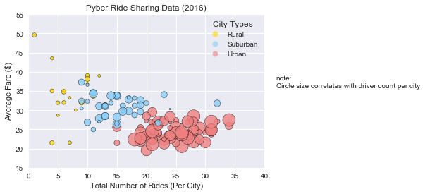
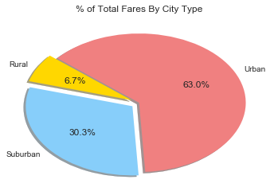
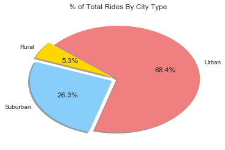
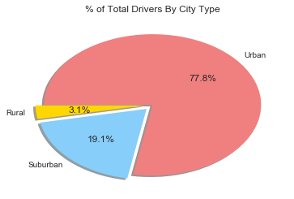

# Pyber Ride Sharing

Trend1: Urban cities have highest number of ride counts (68.4%) as well as driver counts (77.8%). Also these cities have the lowest average fare. 

Trend2: Rural area has the highest average dollar fare ($50) and the lowest number of rides (1).

Trend3: Higher number of drivers will increase the number of rides and will eventually reduce the fare.

Observation: City data set has a duplicate record (city of Port James) which needs to be merged and summed on driver count before merging with ride data.

# Analysis


```python
# import dependencies
import pandas as pd
import seaborn as sns
import matplotlib.pyplot as plt

# read and load the city and ride data
ride_data = pd.read_csv("raw_data/ride_data.csv")
city_data = pd.read_csv("raw_data/city_data.csv")

#add up the duplicate row driver counts
grouped_city_data = city_data.groupby(['city','type']).sum()
new_city_data = grouped_city_data.reset_index()

# merge the city and ride data on city column
merged_data = pd.merge(ride_data, new_city_data, how = 'left', on = 'city').rename(columns={"type":"city_type"})
merged_data.head()
```


<div>
<style>
    .dataframe thead tr:only-child th {
        text-align: right;
    }

    .dataframe thead th {
        text-align: left;
    }

    .dataframe tbody tr th {
        vertical-align: top;
    }
</style>
<table border="1" class="dataframe">
  <thead>
    <tr style="text-align: right;">
      <th></th>
      <th>city</th>
      <th>date</th>
      <th>fare</th>
      <th>ride_id</th>
      <th>city_type</th>
      <th>driver_count</th>
    </tr>
  </thead>
  <tbody>
    <tr>
      <th>0</th>
      <td>Sarabury</td>
      <td>2016-01-16 13:49:27</td>
      <td>38.35</td>
      <td>5403689035038</td>
      <td>Urban</td>
      <td>46</td>
    </tr>
    <tr>
      <th>1</th>
      <td>South Roy</td>
      <td>2016-01-02 18:42:34</td>
      <td>17.49</td>
      <td>4036272335942</td>
      <td>Urban</td>
      <td>35</td>
    </tr>
    <tr>
      <th>2</th>
      <td>Wiseborough</td>
      <td>2016-01-21 17:35:29</td>
      <td>44.18</td>
      <td>3645042422587</td>
      <td>Urban</td>
      <td>55</td>
    </tr>
    <tr>
      <th>3</th>
      <td>Spencertown</td>
      <td>2016-07-31 14:53:22</td>
      <td>6.87</td>
      <td>2242596575892</td>
      <td>Urban</td>
      <td>68</td>
    </tr>
    <tr>
      <th>4</th>
      <td>Nguyenbury</td>
      <td>2016-07-09 04:42:44</td>
      <td>6.28</td>
      <td>1543057793673</td>
      <td>Urban</td>
      <td>8</td>
    </tr>
  </tbody>
</table>
</div>


# Bubble Plot of Ride Sharing Data


```python
# Calculate the average fare and total ride
avg_fare = merged_data.groupby(['city_type','city','driver_count']).mean()['fare']
total_ride = merged_data.groupby(['city_type','city','driver_count']).nunique()['ride_id']
# create a dataframe to have average fare and total ride count
ride_share = pd.DataFrame({"Average Fare ($)" : avg_fare, "Total Number of Rides": total_ride}).reset_index()
ride_share.head()
```


<div>
<style>
    .dataframe thead tr:only-child th {
        text-align: right;
    }

    .dataframe thead th {
        text-align: left;
    }

    .dataframe tbody tr th {
        vertical-align: top;
    }
</style>
<table border="1" class="dataframe">
  <thead>
    <tr style="text-align: right;">
      <th></th>
      <th>city_type</th>
      <th>city</th>
      <th>driver_count</th>
      <th>Average Fare ($)</th>
      <th>Total Number of Rides</th>
    </tr>
  </thead>
  <tbody>
    <tr>
      <th>0</th>
      <td>Rural</td>
      <td>East Leslie</td>
      <td>9</td>
      <td>33.660909</td>
      <td>11</td>
    </tr>
    <tr>
      <th>1</th>
      <td>Rural</td>
      <td>East Stephen</td>
      <td>6</td>
      <td>39.053000</td>
      <td>10</td>
    </tr>
    <tr>
      <th>2</th>
      <td>Rural</td>
      <td>East Troybury</td>
      <td>3</td>
      <td>33.244286</td>
      <td>7</td>
    </tr>
    <tr>
      <th>3</th>
      <td>Rural</td>
      <td>Erikport</td>
      <td>3</td>
      <td>30.043750</td>
      <td>8</td>
    </tr>
    <tr>
      <th>4</th>
      <td>Rural</td>
      <td>Hernandezshire</td>
      <td>10</td>
      <td>32.002222</td>
      <td>9</td>
    </tr>
  </tbody>
</table>
</div>


```python
# filter the datafrane by the type of city
ride_share_urban = ride_share.loc[ride_share.city_type =="Urban",:]
ride_share_rural = ride_share.loc[ride_share.city_type =="Rural",:]
ride_share_suburban = ride_share.loc[ride_share.city_type =="Suburban",:]
city_type = ("Rural", "Suburban", "Urban")

# create three scatter plot for three types of city data
plt.scatter(ride_share_urban['Total Number of Rides'], 
            ride_share_urban['Average Fare ($)'], 
            s=5*ride_share_urban.driver_count, 
            c='LightCoral',
           edgecolors='black',
           linewidths = 0.5,
           alpha =0.8)
plt.scatter(ride_share_rural['Total Number of Rides'], 
            ride_share_rural['Average Fare ($)'], 
            s=5*ride_share_rural.driver_count, 
            c='Gold',
           edgecolors='black',
           linewidths = 0.5,
           alpha =0.8)
plt.scatter(ride_share_suburban['Total Number of Rides'], 
            ride_share_suburban['Average Fare ($)'], 
            s=5*ride_share_suburban.driver_count, 
            c='lightskyblue',
           edgecolors='black',
           linewidths = 0.5,
           alpha =0.8)

plt.title("Pyber Ride Sharing Data (2016)")
plt.xlabel("Total Number of Rides (Per City)")
plt.ylabel("Average Fare ($)")
plt.xlim(0,40)
plt.ylim(15,55)
plt.grid(True)

# add a note next to the plot
plt.text(42,36, "note:\nCircle size correlates with driver count per city", fontsize=10)
# add a grey background to the plot
sns.set()
# add a legend to the plot
import matplotlib.lines as mlines
 
colors = ['Gold',
          'LightSkyBlue',
          'LightCoral']
legend = []
for step in range(len(colors)):
    legend.append(mlines.Line2D([0], [0],
                                        linestyle='none',
                                        marker='o',
                                        alpha=0.6,
                                        markersize=8,
                                        markerfacecolor=colors[step]))
 
plt.legend(legend,
           city_type,
            numpoints=1,
            fontsize=10,
            loc='best',
            title="City Types",
           shadow=True)


plt.show()
```





# Total Fares by City Type


```python
# Calculate the total fare
total_fare = merged_data.fare.sum()
# Grouping by city type to get the total fare by city type
total_fare_type = merged_data.groupby('city_type').sum()['fare']
fare_type_percent = (total_fare_type/total_fare)*100
# create the pie chart, defined explode, labels, colors and the percentage to show on the chart
explode = (0.08, 0.08, 0)
plt.pie(fare_type_percent,explode=explode,labels=city_type, colors=colors, autopct="%1.1f%%", shadow=True, startangle=140)
plt.title("% of Total Fares By City Type")
plt.show()
```





# Total Rides by City Type


```python
# calculate the percentage of total rides per city type
ride_type_percent = 100* (ride_share.groupby('city_type').sum()['Total Number of Rides']/ride_share['Total Number of Rides'].sum())
# create the pie chart, defined explode, labels, colors and the percentage to show on the chart
plt.pie(ride_type_percent,explode=explode,labels=city_type, colors=colors, autopct="%1.1f%%", shadow=True, startangle=140)
plt.title("% of Total Rides By City Type")
plt.show()
```





# Total Drivers by City Type


```python
# Calculate the total driver count
total_driver = new_city_data.driver_count.sum()
# Grouped by city type to get the total driver count by city type
driver_count_type = new_city_data.groupby('type').sum()['driver_count']
driver_count_percent = 100*(driver_count_type/total_driver)
# create the pie chart, defined explode, labels, colors and the percentage to show on the chart
plt.pie(driver_count_percent,explode=explode,labels=city_type, colors=colors, autopct="%1.1f%%", shadow=True, startangle=180)
plt.title("% of Total Drivers By City Type")
plt.show()
```




